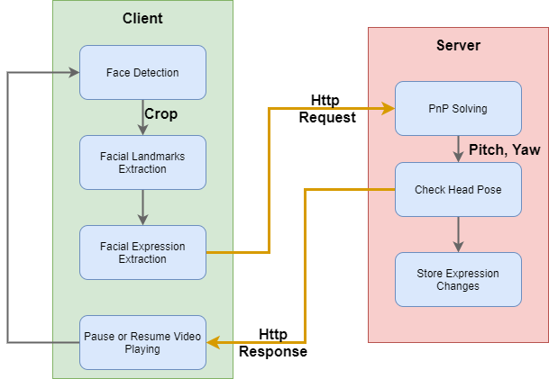
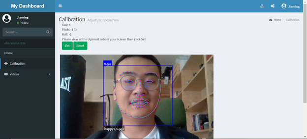
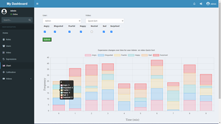
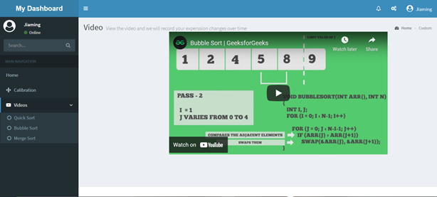

# headpose_expressions_estimation_face-api

## Overview

An online study engagement evaluation system based on head pose estimation and facial expression recognition. The system first extracts facial landmarks and predict facial expression on client side using face-api.js. Then the 2D facial landmarks are sent to the server using http request. The server calculates the head pose, and send back a reponse that indicates if user's head pose in the predefined range. If it is not, the video will be paused, otherwise resume it.



## Setup

* Clone Repository

``` bash
git clone https://github.com/jiamingli9674/headpose_expressions_estimation_face-api.git
```

* Install Dependencies

```bash
pip install -r requirements.txt
```

* Run

```bash
python run.py
```

* Access it @ [http://127.0.0.1:5000/](http://127.0.0.1:5000/)

## Demo

* Login Page  

* Registration Page  

* Caliberation Page (Set head pose limit)  

* Stastistic Page  

* Video Palying Page (You can login as a admin and add new videos by adding new records in video table, Youtube video code is needed)  

